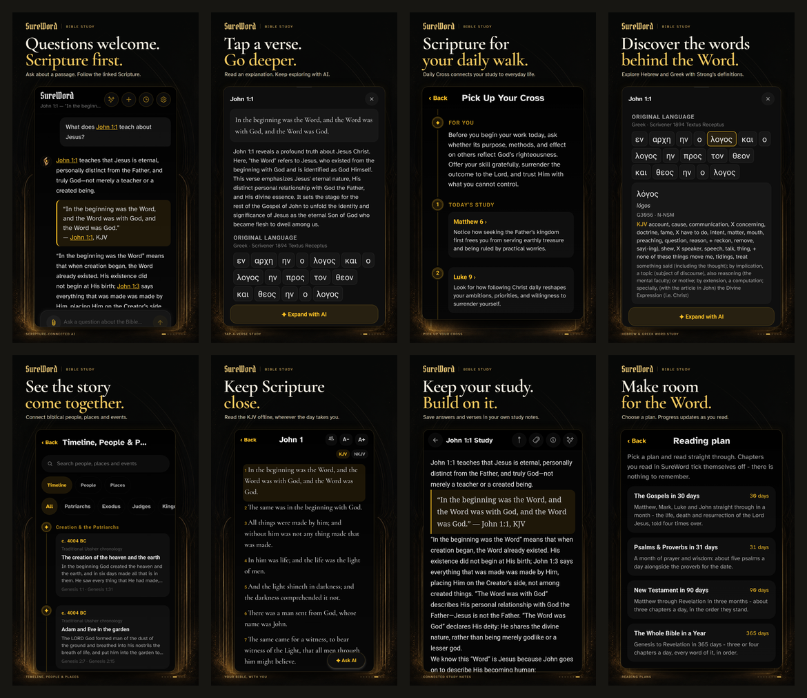

# SureWord Play Store promo images

Eight phone screenshots, ready to upload in numbered order. Every image is **1080 × 1920**, opaque **24-bit RGB PNG**, and includes a real screenshot from **SureWord Android 1.50.0 / versionCode 49**, captured on September 6, 2026.

Open `index.html` for the full gallery or `contact-sheet.png` for the overview. `sureword-play-store-promos.zip` contains only the eight finished images and `alt-text.txt`. Nothing has been uploaded to Play Console.

[](screenshots/)

[Download all eight PNGs](sureword-play-store-promos.zip) · [Alt text](alt-text.txt) · [Research and claims](research-and-claims.md)

1. **Questions welcome. Scripture first.** — real question, completed answer and linked KJV Scripture.
2. **Tap a verse. Go deeper.** — contextual verse explanation and Expand with AI.
3. **Scripture for your daily walk.** — Daily Cross personal application and linked study path.
4. **Discover the words behind the Word.** — Greek word selection and Strong’s definition; Hebrew is also supported.
5. **See the story come together.** — Timeline, People & Places with Scripture-linked events.
6. **Keep Scripture close.** — the bundled offline KJV reader.
7. **Keep your study. Build on it.** — a real study note saved from a chat response.
8. **Make room for the Word.** — reading plans with automatic progress from reading.

`alternate-welcome.png` is an optional alternate for slot 1, featuring the app's stained-glass welcome art. Use it in place of an image, since Google Play supports eight phone screenshots per device type. It is outside the main ZIP.

## How these were made

The built-in Imagegen tool generated the black-and-gold architectural backdrop; its exact prompt is in `imagegen-prompt.txt`. Typography uses SureWord's Pirata One, Cormorant Garamond and Atkinson Hyperlegible fonts. Font licenses are retained in `sources/fonts/`.

App screens were captured with Android `screencap`. They were cropped to remove system bars and focus the relevant content, then resized proportionally and placed into the layouts. **The app UI and its text were not generated, retyped, or retouched.** The renderer checks that every finished screenshot interior matches its prepared original crop exactly. Rounded clipping affects the corners only. See `verification.json` for input hashes, crop rectangles, export checks and the pixel-integrity results.

Three research agents inspected competitor products, actual Play Store visuals, and SureWord's implementation. `research-and-claims.md` records the source links, evidence and claim limits. The copy emphasizes SureWord's connected study experience without unsupported exclusivity, accuracy, price, or ranking claims. Listen is deliberately excluded from the main images because it requires Pro and self-service Pro access is not available yet.

## Edit and rebuild

Change the copy, selected source image, or crop rectangle in `layout-spec.json`, then run from the repository root:

```powershell
node docs/play-store/promo-2026-09-06/render.cjs
```

The renderer uses the Codex bundled Node packages by default. For another installation, set `CODEX_NODE_MODULES` to a Node modules directory containing `playwright` and `sharp`, with a Playwright Chromium browser installed. It writes the eight individual PNGs, editable HTML artwork, gallery, contact sheet and verification report. Source app files are not changed. Rebuild the upload ZIP after changing the images.

The screenshot session created one generic John 1:1 chat and a study note through the app. The emulator's original NKJV selection was restored afterward. No preexisting note was edited.

Intermediate captures and raw UI XML were removed after review; only the selected raw screenshot sources remain. The upload ZIP contains no raw captures, XML, account information, or research files.
